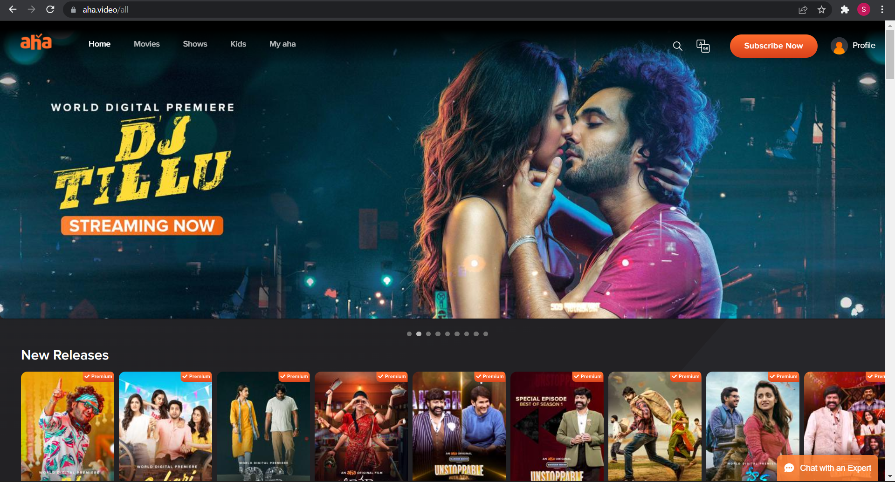

# AHA VIDEO-CLONE  

This project is made for educational purpose only.

**Project Link -** [AHA VIDEO-CLONE](https://aha-clone.netlify.app/)

## About Us:

For the 5th unit of our curriculum at Masai School, we learned about React,Redux, Styled Components and various other liabraries.

As the application part, We got chance to apply all our learnings from that unit and built something as intresting and challenging as this website(Aha Video). We are a team of four took six days to clone this website. As there is no way to show the whole movie or tv shows, our end goal was to play the trailer for the selected content.

## About Aha-Video: 

Aha Video is a typical OTT platform where user can stream and watch various Tv shows and Movies in both Telugu and Tamil language.

## Tech-Stacks & Tools:

* REACT
* REDUX
* STYLED-COMPONENTS
* FIREBASE
* RAZORPAY

## Features:
 
* Dynamic signin and signup page
* User Authentication, Payment Gateway
* Language Toggle
* Play Trailer

## Glimpse of our project:

1. Landing Page

• TELUGU

• TAMIL

2. Singin Page

3. Subscribe Page

4. Payment Page

5. Language Page

6. Movie-Details Page

7. Trailer Play

## Our Team:

* [Dimple Varshney](https://github.com/dimple06varshney)
* [Surendra Kumar Rout](https://github.com/SurendraKumarRout) 
* [Avish Kumar](https://github.com/avishmonga)
* [Vinod Jantikar](https://github.com/Vinod-Jantikar) 
  
